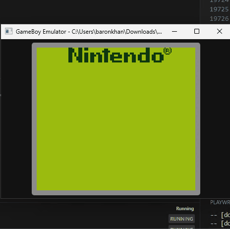
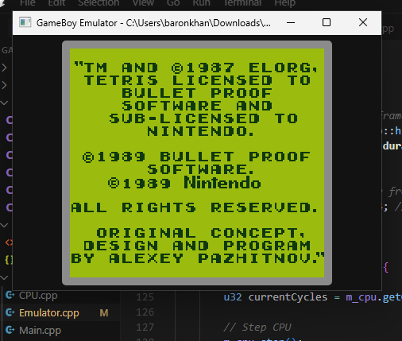

# GameBoy Emulator

An in-progress GameBoy emulator written in C++20 for Windows using AI, rendering in a WebView2.





## Features

- Emulates the GameBoy CPU, PPU, and Memory
- Displays the GameBoy screen using WebView2
- Supports loading GameBoy ROM files
- Implements the basic instructions needed for the boot ROM
- Supports MBC1 ROM bank switching
- Only Loads GameBoy boot room and can display Tetris copyright screen.

## Requirements

- Windows 10 or later
- Visual Studio 2022
- CMake 3.20 or later
- Microsoft Edge WebView2 Runtime

## Building

### Easy Method
Simply run the `build.bat` file included in the project:

```
build.bat
```

### Manual Method
1. Clone the repository
2. Open the project folder in Visual Studio Code
3. Press F5 to build and run the project

Alternatively, you can build the project from the command line:

```
mkdir build
cd build
cmake -G "Visual Studio 17 2022" -A x64 ..
cmake --build . --config Debug
```

## Usage

1. Run the emulator (`build\bin\Debug\GameBoyEmulator.exe`)
2. Select File > Open ROM... to load a GameBoy ROM file
3. The emulator will start running the ROM

## Controls

- File > Open ROM... - Load a GameBoy ROM file
- File > Reset - Reset the emulator
- File > Exit - Exit the emulator
- Emulation > Pause/Resume - Pause or resume emulation

## Project Structure

- `include/` - Header files
- `src/` - Source files
- `resources/` - Resource files (HTML, JSON, etc.)
- `build/` - Build output directory

## Implementation Details

- Uses Meyer's Singleton pattern for core components
- CPU instructions are loaded from a JSON file
- WebView2 is used for rendering the GameBoy screen
- MBC1 ROM bank switching is implemented

## Dependencies

- WebView2 - Downloaded automatically during build
- nlohmann/json - Downloaded automatically during build

## Future Improvements

- Add support for audio
- Add support for input
- Implement more MBC types
- Add save state support
- Improve accuracy and compatibility

## License

This project is open source and available under the MIT License. 